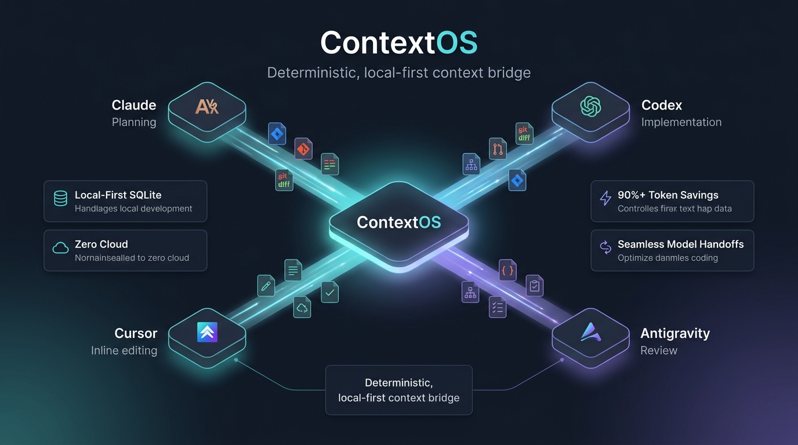

# ContextOS

> **Your AI context should belong to your project — not your chat window.**

<p align="center">
  
</p>

ContextOS is a **local-first context and handoff layer for AI coding agents**.


It keeps the important state of your development work — tasks, decisions, architectural constraints, Git changes, and handoffs — outside your AI chat.

So you can **start a fresh chat, switch between AI agents, or move between IDEs without starting over.**

---

## The Problem

AI coding agents are great at working with code, but their context is often trapped inside individual conversations.

A feature might start with:

```text
5k tokens → 15k → 30k → 50k → 100k+
```

Developers often keep using the same conversation because they are afraid that starting a new chat will mean losing everything the AI already knows.

This creates two problems:

- Long conversations become expensive to maintain.
- Switching from Claude to Codex, Cursor, or another agent means manually rebuilding context.

The problem isn't that the information doesn't exist.

**The problem is that the information belongs to the chat instead of the project.**

---

## The ContextOS Approach

ContextOS moves important development context out of the conversation and into a **local, structured project context**.

```text
                ┌─────────────────────┐
                │      ContextOS      │
                │                     │
                │ Tasks               │
                │ Decisions           │
                │ Invariants          │
                │ Git Context         │
                │ Handoffs            │
                └──────────┬──────────┘
                           │
             ┌─────────────┼─────────────┐
             ↓             ↓             ↓
          Claude         Codex        Cursor
```

Your AI conversation can change.

**Your project context stays.**

---

## Start Fresh Without Starting Over

When a conversation becomes too large, you can start a new one without rebuilding the entire history.

Instead of carrying thousands of tokens of old conversation:

```text
Old conversation
      ↓
     50k+ tokens
      ↓
   New chat
```

ContextOS provides a small, relevant snapshot:

```text
Current task
What has been completed
Important decisions
Architectural constraints
Relevant Git changes
Open issues
```

The goal is to keep the context **bounded and high-signal** rather than carrying the entire conversation forward.

---

## Switch AI Agents Without Losing Context

For example:

```text
Claude
  │
  │ Planning / architecture
  ↓
ContextOS
  │
  │ Shared project state
  ↓
Codex
  │
  │ Implementation
  ↓
ContextOS
  │
  ↓
Claude
  │
  │ Review
```

You don't need to manually explain the entire project again every time you switch agents.

With MCP, an agent can simply retrieve the current ContextOS state and continue from there.

---

## What ContextOS Stores

ContextOS focuses on **development state**, not complete chat history.

### Tasks

Current work, progress, checklists, and open items.

### Decisions

Important architectural and implementation decisions, including superseded decisions.

### Invariants

Rules and constraints that should not be accidentally violated.

### Git Context

Relevant changes, branches, diffs, and repository state.

### Handoffs

Bounded snapshots designed to transfer work between AI sessions or agents.

---

## Why Not Just Save the Chat?

Because a chat is not the same thing as project state.

A conversation contains a lot of information that becomes irrelevant over time:

- repeated explanations
- old debugging attempts
- intermediate ideas
- tool output
- discarded approaches
- conversational noise

ContextOS extracts the information that is useful for continuing the work.

This makes it possible to **leave a long conversation behind without leaving the project context behind.**

---

## Token Efficiency

ContextOS is designed around **bounded context**.

A long-running AI conversation can accumulate tens of thousands of tokens even when only a small portion is still relevant.

ContextOS instead produces compact context snapshots containing the current high-signal state.

For example:

| Approach | Context |
|---|---:|
| Long-running conversation | 40k–120k+ tokens |
| ContextOS handoff | Typically <1k–2.5k tokens |

Actual savings depend on the project and workflow, so these numbers are illustrative rather than guaranteed.

The important idea is:

> **You don't need to keep an old chat alive just because you're afraid of losing its context.**

---

## Local First

ContextOS is designed to run locally.

- No mandatory cloud service
- No mandatory LLM API
- No external database setup
- SQLite storage
- Project-local and global context
- Works with the AI tools you already use

Your context stays under your control.

---

## MCP Integration

ContextOS exposes its context through **Model Context Protocol (MCP)**.

This allows supported AI coding agents to read and update project context directly.

Example:

```text
"Check ContextOS for the current task context
and continue the implementation."
```

The agent can retrieve the relevant project state instead of requiring the entire previous conversation.

---

## Current Features

ContextOS currently provides:

- Local SQLite context storage
- Project and global context
- MCP integration
- CLI interface
- Task and checklist tracking
- Architectural decisions / ADRs
- Decision supersession and DAG validation
- Git context and diff tracking
- Secret/noise filtering
- Deterministic bounded handoffs
- Handoff archives
- Clipboard-based handoffs
- Cross-storage context fallback

---

## Example Workflow

### 1. Plan with Claude

Claude works on the architecture and records important decisions.

### 2. Save the state

ContextOS stores:

```text
Task
├── Current progress
├── Decisions
├── Constraints
├── Git changes
└── Open questions
```

### 3. Start a new Codex session

Instead of pasting the entire old conversation:

```text
Check ContextOS and continue the current task.
```

### 4. Continue implementation

Codex retrieves the relevant state and continues from the latest project context.

### 5. Hand back for review

The updated state can be handed to another agent for review or debugging.

---

## Architecture

```text
AI Coding Agent
      │
      │ MCP / CLI
      ↓
┌──────────────────────┐
│      ContextOS       │
│                      │
│ Context Builder      │
│ Task State           │
│ Decisions / ADRs     │
│ Git Context          │
│ Handoffs             │
└──────────┬───────────┘
           │
           ↓
      Local SQLite
```

The context layer remains independent from any particular AI provider.

---

## Design Principles

**Local first**  
Your project context should not require a cloud service.

**Agent independent**  
Context should not belong to Claude, Codex, Cursor, or any single model.

**Deterministic**  
Important project state should be explicit and predictable.

**Bounded**  
Retrieve the context needed for the task instead of carrying everything forward.

**Developer controlled**  
The developer decides what becomes durable project context.

---

## Roadmap

- Role-specific context for planner / implementer / reviewer agents
- Multi-agent workflow state
- Smarter context selection
- AST / Tree-sitter based code context
- Dynamic token budgets
- SQLite FTS5 search
- Multi-repository workspaces
- Jira / Linear integration
- More AI agent integrations

👉 **[Read the full Upcoming Features & Vision Document](UPCOMING_FEATURES.md)**

---

## What ContextOS Is Not

ContextOS is **not**:

- another AI chatbot
- an LLM provider
- a replacement for Claude, Codex, Cursor, or other coding agents
- a cloud-based memory service
- a system that requires sending your code to an external API

It is the **context layer between your project and the AI agents working on it.**

---

## Vision

AI coding agents are becoming increasingly capable, but developers still have to manage the context around them.

ContextOS aims to make that context **portable, structured, local, and independent of any single AI tool**.

Instead of:

```text
Project → Chat → AI
```

the goal is:

```text
              ┌── Claude
              │
Project → ContextOS ── Codex
              │
              └── Other Agents
```

**Your project should own the context.**

---

## Documentation

- [Upcoming Features & Vision](UPCOMING_FEATURES.md)
- [MCP Guide](docs/MCP_GUIDE.md)
- [Setup & Usage Guide](docs/SETUP_AND_USAGE_GUIDE.md)
- [PRD](docs/PRD.md)
- [Technical Requirements](docs/TRD.md)


---

## Contributing

ContextOS is open source and contributions are welcome.

Areas where contributions are especially useful:

- AI agent integrations
- MCP tooling
- Context optimization
- Developer workflows
- Issue tracker integrations

---

## License

See [LICENSE](LICENSE).