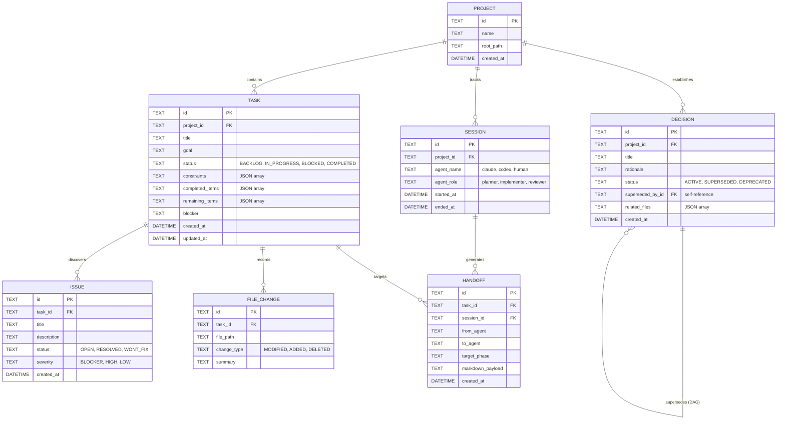
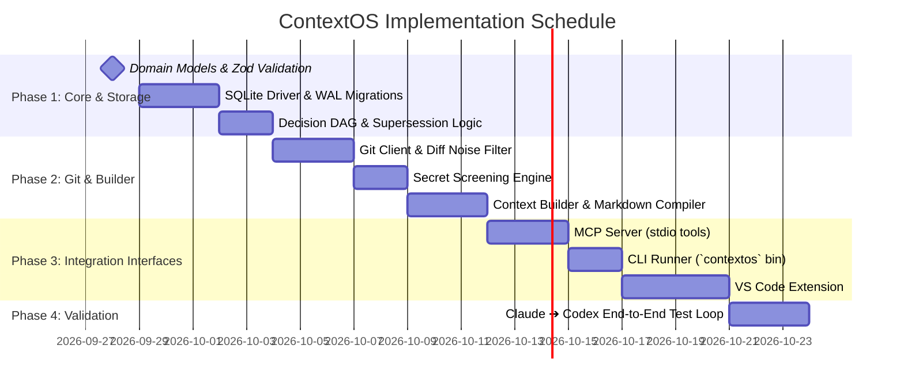

# ContextOS: Technical Requirements Document (TRD)

| Metadata | Details |
| :--- | :--- |
| **Project Name** | **ContextOS** |
| **Document Type** | Technical Requirements Document (TRD) |
| **Version** | `1.0.0-MVP` |
| **Status** | Approved for Implementation |
| **Language & Runtime** | TypeScript / Node.js 20+ (Targeting ES2022) |
| **Database** | Embedded SQLite 3 (WAL Mode) via `better-sqlite3` |

---

## 1. System Architecture & Component Topology

ContextOS is architectured as a local, multi-package monorepo operating on top of a project's local workspace. It decouples the context and state management from any single AI vendor or IDE runtime.

```
                          Developer / Workspace Environment
                                         │
        ┌────────────────────────────────┼────────────────────────────────┐
        ▼                                ▼                                ▼
  VS Code Extension                 CLI Runner                       MCP Server
 (Command Palette / UI)         (`contextos` binary)           (stdio for Claude/Codex)
        │                                │                                │
        └────────────────────────────────┼────────────────────────────────┘
                                         ▼
                             ┌───────────────────────┐
                             │    @contextos/core    │
                             │ (Services & Contracts)│
                             └───────────┬───────────┘
                                         │
                ┌────────────────────────┴────────────────────────┐
                ▼                                                 ▼
      ┌────────────────────┐                            ┌────────────────────┐
      │ @contextos/storage │                            │  @contextos/git    │
      │ (SQLite + Disk)    │                            │(CLI Wrapper & Diff)│
      └─────────┬──────────┘                            └─────────┬──────────┘
                ▼                                                 ▼
        .contextos/context.db                             .git / Workspace
```

### Component Roles & Boundaries
1. **`@contextos/core`**: Domain data models, Zod validation schemas, business logic (decision supersession, state transitions), and contract definitions. Pure TypeScript with zero native binary bindings.
2. **`@contextos/storage`**: SQLite database driver, schema migrations, and query repositories.
3. **`@contextos/git`**: High-performance Git CLI wrapper for branch detection, working tree dirty state, noise-filtered diff generation, and secret screening.
4. **`@contextos/context-builder`**: Deterministic relevance engine and markdown compiler that fits context into explicit token budgets.
5. **`@contextos/mcp`**: JSON-RPC over stdio Model Context Protocol server exposing tool endpoints to coding agents.
6. **`apps/vscode-extension`**: VS Code client providing status bar integration, commands, and clipboard utilities.

---

## 2. Domain Data Model & Storage Schema

### 2.1 Entity Relationship Diagram (ERD)



### 2.2 SQLite Schema Definition (DDL)

```sql
PRAGMA journal_mode = WAL;
PRAGMA foreign_keys = ON;

CREATE TABLE IF NOT EXISTS projects (
    id TEXT PRIMARY KEY,
    name TEXT NOT NULL,
    root_path TEXT NOT NULL UNIQUE,
    created_at TEXT NOT NULL DEFAULT (datetime('now'))
);

CREATE TABLE IF NOT EXISTS sessions (
    id TEXT PRIMARY KEY,
    project_id TEXT NOT NULL REFERENCES projects(id) ON DELETE CASCADE,
    agent_name TEXT NOT NULL,
    agent_role TEXT NOT NULL, -- 'planner' | 'implementer' | 'reviewer'
    started_at TEXT NOT NULL DEFAULT (datetime('now')),
    ended_at TEXT
);

CREATE TABLE IF NOT EXISTS tasks (
    id TEXT PRIMARY KEY,
    project_id TEXT NOT NULL REFERENCES projects(id) ON DELETE CASCADE,
    title TEXT NOT NULL,
    goal TEXT NOT NULL,
    status TEXT NOT NULL CHECK(status IN ('BACKLOG', 'IN_PROGRESS', 'BLOCKED', 'COMPLETED')),
    constraints TEXT NOT NULL DEFAULT '[]', -- JSON Array<string>
    completed_items TEXT NOT NULL DEFAULT '[]', -- JSON Array<string>
    remaining_items TEXT NOT NULL DEFAULT '[]', -- JSON Array<string>
    blocker TEXT,
    created_at TEXT NOT NULL DEFAULT (datetime('now')),
    updated_at TEXT NOT NULL DEFAULT (datetime('now'))
);

CREATE TABLE IF NOT EXISTS decisions (
    id TEXT PRIMARY KEY,
    project_id TEXT NOT NULL REFERENCES projects(id) ON DELETE CASCADE,
    title TEXT NOT NULL,
    rationale TEXT NOT NULL,
    status TEXT NOT NULL CHECK(status IN ('ACTIVE', 'SUPERSEDED', 'DEPRECATED')),
    superseded_by_id TEXT REFERENCES decisions(id) ON DELETE SET NULL,
    related_files TEXT NOT NULL DEFAULT '[]', -- JSON Array<string>
    created_at TEXT NOT NULL DEFAULT (datetime('now'))
);

CREATE TABLE IF NOT EXISTS issues (
    id TEXT PRIMARY KEY,
    task_id TEXT NOT NULL REFERENCES tasks(id) ON DELETE CASCADE,
    title TEXT NOT NULL,
    description TEXT,
    status TEXT NOT NULL CHECK(status IN ('OPEN', 'RESOLVED', 'WONT_FIX')),
    severity TEXT NOT NULL CHECK(severity IN ('BLOCKER', 'HIGH', 'LOW')),
    created_at TEXT NOT NULL DEFAULT (datetime('now'))
);

CREATE TABLE IF NOT EXISTS file_changes (
    id TEXT PRIMARY KEY,
    task_id TEXT NOT NULL REFERENCES tasks(id) ON DELETE CASCADE,
    file_path TEXT NOT NULL,
    change_type TEXT NOT NULL CHECK(change_type IN ('MODIFIED', 'ADDED', 'DELETED')),
    summary TEXT
);

CREATE TABLE IF NOT EXISTS handoffs (
    id TEXT PRIMARY KEY,
    task_id TEXT NOT NULL REFERENCES tasks(id) ON DELETE CASCADE,
    session_id TEXT REFERENCES sessions(id) ON DELETE SET NULL,
    from_agent TEXT NOT NULL,
    to_agent TEXT NOT NULL,
    target_phase TEXT NOT NULL,
    markdown_payload TEXT NOT NULL,
    created_at TEXT NOT NULL DEFAULT (datetime('now'))
);

-- Indices for rapid query performance
CREATE INDEX IF NOT EXISTS idx_tasks_status ON tasks(project_id, status);
CREATE INDEX IF NOT EXISTS idx_decisions_active ON decisions(project_id, status);
CREATE INDEX IF NOT EXISTS idx_issues_task_status ON issues(task_id, status);
CREATE INDEX IF NOT EXISTS idx_handoffs_created ON handoffs(task_id, created_at DESC);
```

### 2.3 Decision Supersession Logic
To prevent cyclic graphs and maintain strict historical provenance:
```typescript
async function supersedeDecision(oldId: string, newId: string, db: Database): Promise<void> {
  // 1. Verify DAG invariant (prevent cycles)
  let curr = newId;
  while (curr) {
    const parent = db.prepare('SELECT superseded_by_id FROM decisions WHERE id = ?').get(curr);
    if (parent?.superseded_by_id === oldId) {
      throw new Error(`Cycle detected: Decision ${newId} cannot supersede ${oldId}`);
    }
    curr = parent?.superseded_by_id;
  }

  // 2. Atomic status transition
  db.transaction(() => {
    db.prepare("UPDATE decisions SET status = 'SUPERSEDED', superseded_by_id = ? WHERE id = ?").run(newId, oldId);
    db.prepare("UPDATE decisions SET status = 'ACTIVE' WHERE id = ?").run(newId);
  })();
}
```

---

## 3. Storage Layer & File System Layout

ContextOS state is housed entirely inside the `.contextos/` folder within the workspace root:

```text
<workspace-root>/
├── .gitignore                    # ContextOS guarantees '.contextos/' is present
└── .contextos/
    ├── context.db                # SQLite 3 database file
    ├── context.db-wal            # SQLite Write-Ahead Log
    ├── context.db-shm            # Shared memory file
    ├── config.json               # Local project configuration (agent roles)
    └── handoffs/
        ├── latest.md             # Active handoff snapshot ready for downstream ingestion
        └── archive/              # Historical handoff documents
            └── 2026-09-26T14-30-00_claude_to_codex.md
```

### WAL Mode Justification:
- Multiple processes (VS Code Extension, background MCP server, interactive CLI) access `context.db` concurrently.
- WAL (Write-Ahead Logging) allows concurrent readers without blocking writers, preventing database locked errors (`SQLITE_BUSY`).

---

## 4. Git Integration Engine

The Git engine reconciles conceptual task states with actual filesystem modifications.

### 4.1 Diff Extraction & Noise Elimination Pipeline
```
[ Working Tree ]
       │
       ▼ `git status --porcelain=v1`
[ File Status List ] ──> Filter (Blocklists & Glob Ignore)
       │
       ▼ `git diff -U3 -- <whitelisted-files>`
[ Raw Diff Hunks ] ──> Secret Screening Regex
       │
       ▼ Token Line Budgeting
[ Clean Focused Git Context ]
```

### 4.2 Noise Filter Rules
The engine skips diff collection for files matching:
1. **Lockfiles**: `package-lock.json`, `pnpm-lock.yaml`, `yarn.lock`, `Cargo.lock`, `poetry.lock`, `Gemfile.lock`.
2. **Build Outputs**: `dist/**`, `build/**`, `.next/**`, `out/**`, `target/**`.
3. **Minified Code / Source Maps**: `*.min.js`, `*.min.css`, `*.map`.
4. **Binary Files**: Images, compiled artifacts, fonts, archives.

### 4.3 Truncation Rules
- If a single file diff exceeds **150 lines**, collapse hunk content into statistical summary:  
  `File modified (+420 lines, -110 lines) [Full diff omitted for brevity]`.
- Total git diff payload across all files is capped at **1,000 lines / ~4,000 tokens**.

---

## 5. Context Builder & Relevance Filtering

The Context Builder deterministically compiles the handoff document without calling an LLM.

### 5.1 Token Budget Allocation Ladder
Target budget: **4,000 tokens (~16 KB Markdown)**.

```
Total Budget: 4,000 Tokens
├── Tier 0: Mandatory Core (100% Guaranteed, ~600 tokens)
│   ├── Task Title, Goal, Status
│   ├── Architectural Invariants & Constraints
│   ├── Active Blocker & Immediate Next Step
│
├── Tier 1: High Relevance (~1,000 tokens)
│   ├── Active Decisions on Touched Files
│   ├── Unresolved Issues / Failing Test Names
│   └── Git Status Summary (Files touched & branches)
│
├── Tier 2: Code Reality (~1,800 tokens)
│   └── Filtered Git Diffs (Truncated per file budget)
│
└── Tier 3: Context Enrichers (Remainder, ~600 tokens)
    ├── Recent Commit Log (last 3 commits)
    └── Completed Checklist Items
```

### 5.2 Handoff Document Markdown Specification

The generated `.contextos/handoffs/latest.md` conforms to the following strict layout:

````markdown
# ContextOS Handoff: [from_agent] ➔ [to_agent]
**Generated:** [ISO-8601 Timestamp]  
**Phase:** [Planning | Implementation | Review]  

---

## 1. Task Specification
- **Task:** [Task Title]
- **Goal:** [Task Goal Description]
- **Status:** [IN_PROGRESS | BLOCKED]
- **Current Blocker:** [Blocker description or "None"]

## 2. Invariants & Constraints (MUST PRESERVE)
- [Constraint 1]
- [Constraint 2]

## 3. Active Architectural Decisions
- **[Decision Title]**: [Rationale]
  - *Related Files:* `path/to/file.ts`

## 4. Work Progress
- [x] [Completed item 1]
- [ ] **CURRENT:** [Remaining item 1]
- [ ] [Remaining item 2]

## 5. Git & Working Tree State
- **Branch:** `[branch-name]`
- **HEAD:** `[commit-hash]` ([commit-message])
- **Modified Files:**
  - `[file1]` (Modified)
  - `[file2]` (Added)

## 6. Focused Diff
```diff
[Filtered diff content]
```

## 7. Known Issues & Test Failures
- **[Issue Title]** ([Severity]): [Error description / Stack]

## 8. Recommended Next Action
[Specific instruction for the downstream agent]
````

---

## 6. Model Context Protocol (MCP) Server Specification

ContextOS exposes an MCP server running on `stdio` adhering to MCP specification `2024-11-05`.

### 6.1 Tool Schemas

#### 1. `get_current_task`
* **Description**: Returns the active task, constraints, completed items, remaining items, and blockers.
* **Input**: `{ projectId?: string }`
* **Output**: `TaskObject`

#### 2. `save_context`
* **Description**: Updates task state, records completed items, or logs new constraints.
* **Input**:
  ```typescript
  {
    taskId?: string;
    completedItems?: string[];
    remainingItems?: string[];
    newConstraints?: string[];
    blocker?: string | null;
    status?: "IN_PROGRESS" | "BLOCKED" | "COMPLETED";
  }
  ```

#### 3. `record_decision`
* **Description**: Records an architectural invariant or supersedes an older decision.
* **Input**:
  ```typescript
  {
    title: string;
    rationale: string;
    relatedFiles?: string[];
    supersedesDecisionId?: string;
  }
  ```

#### 4. `create_handoff`
* **Description**: Triggers context compilation, writes `.contextos/handoffs/latest.md`, and returns the markdown payload.
* **Input**:
  ```typescript
  {
    fromAgent: string;
    toAgent: string;
    targetPhase: "planning" | "implementation" | "review";
    taskId?: string;
  }
  ```
* **Output**: `{ handoffPath: string; markdown: string; tokenCountEstimate: number }`

#### 5. `get_git_context`
* **Description**: Retrieves branch information, modified files, and filtered diff.
* **Input**: `{ maxLines?: number }`

---

## 7. Security, Privacy & Secret Screening

### 7.1 Secret Screening Regex Engine
All file contents and diff hunks pass through an entropy and regex scanner before being saved or serialized:

| Secret Type | Regex Pattern Pattern Matcher |
| :--- | :--- |
| **Generic API Key** | `(?i)(api[_-]?key\|secret\|token\|password)\s*[:=]\s*['"][a-zA-Z0-9_\-]{16,}['"]` |
| **OpenAI API Key** | `sk-[a-zA-Z0-9]{20,T3BlbkFJ[a-zA-Z0-9]{20,}` |
| **GitHub Token** | `(ghp\|gho\|ghu\|ghs\|ghr)_[A-Za-z0-9_]{36,}` |
| **AWS Access Key** | `(A3T[A-Z0-9]\|AKIA\|AGPA\|AROA\|AIPA\|ANPA\|ANVA\|ASIA)[A-Z0-9]{16}` |
| **Private Key Header** | `-----BEGIN (RSA\|OPENSSH\|EC\|PGP)? PRIVATE KEY-----` |

Any matched line is immediately replaced with `[REDACTED SECRET DETECTED]` and a warning issue is created in the active task.

---

## 8. Monorepo Structure & Package Definitions

ContextOS is organized as a pnpm workspace:

```text
contextos/
├── package.json                   # Root scripts and workspace config
├── pnpm-workspace.yaml            # packages/* and apps/*
├── tsconfig.base.json             # Shared strict TS rules (target ES2022)
│
├── packages/
│   ├── core/                      # Pure domain models, Zod schemas, state engine
│   │   ├── src/
│   │   │   ├── models/            # Entity interfaces & Zod validators
│   │   │   ├── services/          # TaskService, DecisionService
│   │   │   └── index.ts
│   │   └── package.json
│   │
│   ├── storage/                   # SQLite database & repository implementations
│   │   ├── src/
│   │   │   ├── migrations/        # DDL scripts
│   │   │   ├── repositories/      # SqliteTaskRepo, SqliteDecisionRepo
│   │   │   ├── connection.ts      # better-sqlite3 wrapper with WAL setup
│   │   │   └── index.ts
│   │   └── package.json
│   │
│   ├── git/                       # Git CLI parser & diff noise filter
│   │   ├── src/
│   │   │   ├── diff-filter.ts
│   │   │   ├── git-client.ts
│   │   │   └── index.ts
│   │   └── package.json
│   │
│   ├── context-builder/           # Deterministic token budgeting & markdown compiler
│   │   ├── src/
│   │   │   ├── budget-allocator.ts
│   │   │   ├── markdown-formatter.ts
│   │   │   └── index.ts
│   │   └── package.json
│   │
│   └── mcp/                       # MCP Server exposing stdio tools
│       ├── src/
│       │   ├── server.ts
│       │   ├── tools/
│       │   └── index.ts
│       └── package.json
│
├── apps/
│   ├── cli/                       # Command-line interface (`contextos`)
│   │   └── src/index.ts
│   │
│   └── vscode-extension/          # VS Code extension bundle
│       ├── src/
│       │   ├── extension.ts
│       │   ├── commands/
│       │   └── statusBar.ts
│       └── package.json
│
└── docs/
    ├── PRD.md                     # Product Requirements Document
    └── TRD.md                     # Technical Requirements Document
```

---

## 9. Phased Implementation Roadmap



### Verification Acceptance Criteria:
- **Unit Tests**: Minimum 90% test coverage across `@contextos/core`, `@contextos/storage`, and `@contextos/context-builder`.
- **Latency Benchmark**: `create_handoff` completes in under 200ms on a repository with 5,000 commits and 50 modified files.
- **Diff Invariant**: Lockfiles and high-entropy API secrets never appear in `.contextos/handoffs/latest.md`.

